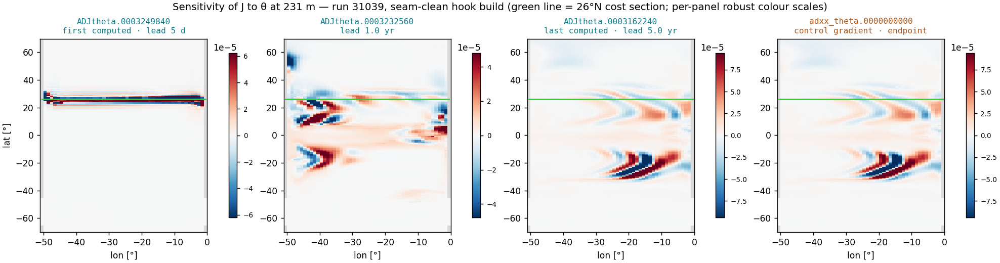
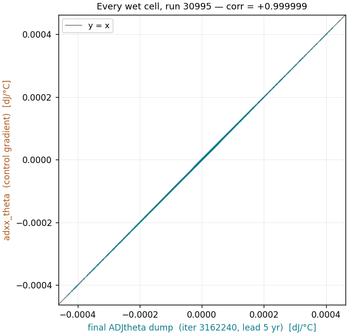

# adxx vs ADJ: the two sensitivity outputs of a Tapenade adjoint run

*Practical reference — DINO_1deg, MITgcm checkpoint69m + Tapenade, written
2026-09-01. Every source claim below was verified against the working tree at
commit `1d6bfa1`; every number is the DINO 5-yr adjoint configuration
(runs 30995 / 31039–31046: `nIter0=3162240`, 87 840 steps, ΔT = 1800 s,
`adjDumpFreq` = 5 d). A styled copy of this note lives beside it as
[`adxx_vs_adj_note.html`](adxx_vs_adj_note.html) — self-contained, opens in any
browser. How the dump hooks came to exist is
[`../tapenade_hooks/`](../tapenade_hooks/)'s story; this note is about what the
outputs* **mean**.*

An MITgcm Tapenade-adjoint run writes two families of sensitivity files. They
overlap for some fields, but they are produced by different machinery, at
different times, with different numbering — and they answer different
questions.

- **`ADJ*`** — adjoint-state snapshots: the reverse sweep, filmed.
- **`adxx_*`** — control gradients: the endpoint, one per control.

## 1 · The one-screen answer

| | `ADJ*` diagnostic dumps | `adxx_*` control gradients |
| --- | --- | --- |
| represents | ∂J/∂(state at time *t*) — the adjoint variables `thetab`, `saltb`, `uVelb`, … as the reverse sweep passes time *t* | ∂J/∂(control) — the accumulated gradient w.r.t. each control declared in `data.ctrl`, weights applied (unit weights here) |
| what selects the set | the hand-wired dump-hook field list — **12 fields**, fixed in code, independent of `data.ctrl` | `data.ctrl` — one file per control family, **16 here**, automatic |
| produced by | `TAP_DUMMY_IN_STEPPING_B` / `TAP_DUMMY_FOR_ETAN_B` → `DUMP_ADJ_XYZ` (pkg/autodiff) | the adjoint of the control *read* — pkg/autodiff's active-file machinery (`active_file_control.F`) |
| written when | during the reverse sweep, every `adjDumpFreq` (5 d) → 366 dumps per field per run | once, when the sweep reaches `nIter0` — the very end of the run |
| file numbering | 10-digit **forward-model iteration** of the snapshot (`3162240…3249840`) | 10-digit **optimization-cycle** counter — always `0000000000` here; *not* a timestep |
| precision | float32 (`writeBinaryPrec`) | float64 |
| use it for | lead-time structure, propagation movies, blow-up forensics | gradients: gradient checks, ΔJ predictions, optimization, surrogate targets |

The bridge between them: for an *initial-condition* control, the control **is**
the state at the window start — so `adxx_theta` and the **last-computed**
(lowest-numbered) `ADJtheta` dump are the same object through two different
pipelines. Measured on the seam-clean run 31039: pattern correlation
**+1.000000**, equal to float32 rounding (§7 — pre-fix run 30995 gave
+0.999999, its 0.7 % residual being entirely the seam artifact).

## 2 · Two objects, two pipelines

**`ADJ*`.** During the reverse sweep the model carries one adjoint variable per
state variable — Tapenade's `b`-suffixed twins (`thetab(i,j,k)` =
∂J/∂θ(i,j,k,t)). These fields *evolve* as the sweep runs backward: at the
cost-window end they hold only the direct cost forcing on the 26°N section;
sweeping back they pick up advection, diffusion and wave dynamics. An `ADJ*`
file is a snapshot of one of them, taken every `adjDumpFreq`. The dumped set is
a code-level choice — the 11 fields passed to `TAP_DUMMY_IN_STEPPING` in
`code_tap/forward_step.F`, plus `etaN` through its own hook — and has nothing
to do with `data.ctrl`.

**`adxx_*`.** pkg/ctrl defines each `xx_*` entry in `data.ctrl` as a control: a
named, weighted perturbation handle (initial θ, initial S, κ_v, surface
forcing, …). The forward model *reads* each control file once via
`ACTIVE_READ`; reverse-mode AD turns that read into a gradient *write*: when
the sweep reaches the point where the read happened, the accumulated adjoint of
that read is written out with an `ad`-prefixed filename —
`pkg/autodiff/active_file_control.F` literally does
`ADD_PREFIX('ad', xx_file)`, which is where the name `adxx_` comes from. One
float64 gradient per control, weights applied. With this project's unit weights
(`ones_64b.bin`) it is the raw gradient.

Consequence of the independence: `xx_uwind` has an `adxx_uwind` but no
`ADJuwind`; `wVel` and `etaN` have `ADJwvel`/`ADJetan` but no `adxx`
counterpart. Full map in §8.

## 3 · Who writes what — the call path

```
DURING EVERY BACKWARD STEP (dumped every adjDumpFreq = 5 d)          [ADJ*]

  FORWARD_STEP_B                       generated forward_step_b.f
    ├─ TAP_DUMMY_IN_STEPPING_B         code_tap/addummy_in_stepping.F
    │    ├─ ADEXCH_* halo folds        code_tap/stubs_tap_adj.F
    │    └─ DUMP_ADJ_XYZ / _XY         pkg/autodiff
    │                                    -> ADJtheta.<iter> ... x11  (float32)
    └─ INTEGR_CONTINUITY_B             (nested in FORWARD_STEP_B)
         └─ TAP_DUMMY_FOR_ETAN_B       code_tap/addummy_for_etan.F
                                       no halo fold, own counter dumpAdRecEt
                                         -> ADJetan.<iter>          (float32)

ONCE, WHEN THE SWEEP REACHES nIter0 (the very end)                  [adxx_*]

  adjoint of CTRL_MAP_INI_*            the control read, run backward
    └─ ACTIVE_READ reversed -> ad-prefixed accumulate-and-write
       pkg/autodiff/active_file_control.F: ADD_PREFIX('ad', xx_file)
                                         -> adxx_theta.0000000000 ... x16 (float64)
```

The same trace as a call tree, for one DINO 5-yr adjoint:

```
mitgcmuv_tap_adj
└─ THE_MODEL_MAIN                          model/src/the_model_main.F (vendored; code_tap/ carries no copy)
   ├─ forward sweep — THE_MAIN_LOOP        taped (checkpoints + store)
   │    ├─ CTRL_MAP_INI_GENARR/GENTIM2D    reads xx_theta.0000000000 … (ACTIVE_READ)
   │    ├─ 87 840 × FORWARD_STEP           physics; cost_atlantic_heat accumulates
   │    │                                  over the final 30 d (lastinterval)
   │    └─ COST_FINAL                      fc → costfunction.0000
   └─ reverse sweep — THE_MAIN_LOOP_B      seeded with fcb = 1
        ├─ 87 840 × backward step
        │    └─ FORWARD_STEP_B             (dump hooks as above, every 5 d)
        └─ sweep reaches nIter0:
             adjoint of the control reads  → adxx_* files, one per control
```

## 4 · Where the hooks come from

The `ADJ*` dumps exist upstream because TAF's `.flow` directives (`ADNAME`) can
force the hand-written `ADDUMMY_IN_STEPPING` into the reverse sweep even though
the forward hook `DUMMY_IN_STEPPING` carries no active data. Tapenade has no
such directive — its external-library mechanism is purely data-flow driven, so
a passive hook is simply dropped from the backward sweep. Since 2026-08-31 both
setups bridge that gap the same way: the `-mods` shadow `forward_step.F` passes
the 11 state fields to `TAP_DUMMY_IN_STEPPING`, and `code_tap/flow_tap_local`
(injected via `-tap_extra "-ext …"`) declares them active — so Tapenade itself
generates the `CALL TAP_DUMMY_IN_STEPPING_B(theta, thetab, …)` at the
reverse-sweep mirror point. Same pattern for `etaN`. The full story — gap,
mechanism, validation, upstreaming — is [`../tapenade_hooks/`](../tapenade_hooks/).

> **Extending the dump set is a four-file change, not a namelist change.** The
> field list is baked into (1) the hook call in `forward_step.F`, (2) the
> activity declaration in `flow_tap_local`, (3) the hand-written `_B`/`_D`
> bodies, and (4) the `check_gen_call` argument-count assertion in both build
> scripts (25 args for the stepping hook — F77 would silently misalign a
> mismatch). Adding a *control*, by contrast, is `data.ctrl` + a weight file,
> and its `adxx_*` comes for free.

## 5 · One run on a timeline

```
         iter 3162240                                            iter 3250080
         yr 2180 · lead 5.0 yr                                yr 2185 · lead 0
         |                                                                  |
FORWARD  o------------------------------------------------------------[##]>|  taped
         |reads xx_* controls (ACTIVE_READ)         cost: terminal 30 d -> fc
         |
REVERSE  <==|====|====|====|====|====|====|====|====|====|====|====|====|==|  computation
         ^   ADJ*.<iter> written every 5 d — 366 dumps, numbered by            order:
         |   forward iteration, computed right -> left                         right to left
         |
         ├─ last computed:  ADJ*.0003162240   = fully accumulated (lead 5 yr)
         └─ then:           adxx_*.0000000000 = adjoint of the control read
                            = final ADJ dump to float32 rounding:
                              corr +1.000000, max rel diff 3e-8  (run 31039)
```

The forward sweep runs left→right, reading the controls at the start and
accumulating the cost only over the terminal 30 days (`lastinterval` =
2 592 000 s; run 31039's `fc = 3.30992121938681E-01`). The reverse sweep runs
right→left, writing `ADJ*` snapshots as it passes each 5-day mark — so the
*highest*-numbered file (`0003249840`) is computed *first* and holds ~30 days
of accumulation, while the *lowest*-numbered (`0003162240`) is computed *last*
and holds the full 5 years. The `adxx_*` write is the final act. The
window-end iteration (`3250080`) itself is not dumped.



*The timeline made real — θ-sensitivity at 231 m, run 31039 (the seam-clean
hook build). The reverse
sweep's first-computed dump (left) holds only ~30 days of accumulation: a band
hugging the 26°N cost section, where the terminal-month cost forcing enters. By
lead 1 yr the signal has spread through the gyres; the last-computed dump
(lead 5.0 yr) is the fully accumulated pattern — and `adxx_theta` (right) is
the same field arriving through the other pipeline. Note the per-panel colour
scales. (An earlier version of this figure, drawn from pre-fix run 30995,
showed faint tile-seam stripes in the left panel — the §8 artifact, since
removed by the 2026-09-01 rerun.)*

## 6 · Numbering and timestamps

- **`ADJtheta.0003187920.data`** — the 10-digit number is the **absolute
  forward-model iteration** of the snapshot. Convert with `t = iter × 1800 s`
  (model year ≈ `2000 + iter/17568` in the analysis convention); **lead** =
  `(3250080 − iter)/17568` yr = years before the cost-window end. Files sort by
  forward time; the adjoint computed them in *descending* order.
- **`adxx_theta.0000000000.data`** — the suffix is pkg/ctrl's **optimization-
  cycle counter** (`optimcycle`), not an iteration. This project never iterates
  the optimizer, so it is always 0; the `.meta` records `timeStepNumber = 0`
  for the same reason. Never read it as "iteration 0 of the model".
- **Precision differs**: `ADJ*` are float32, `adxx_*` float64 — always parse
  the `.meta` (`dataprec`) rather than assuming; a wrong dtype guess silently
  reshapes into plausible garbage.

## 7 · The fully back-propagated state ≈ adxx

For initial-condition controls the equivalence is measurable. On the
seam-clean run 31039 (θ, wet cells only):

- corr(`adxx_theta`, `ADJtheta.0003162240`) = **+1.000000**, RMS ratio 1.00000,
  max pointwise difference 3×10⁻⁸ of the field peak — exactly the float32
  rounding of the dump, nothing more;
- corr(`adxx_theta`, `ADJtheta.0003249840`) = **−0.005** — the first-computed
  dump is essentially unrelated to the accumulated gradient.



*The equivalence, cell by cell: `adxx_theta` against the final `ADJtheta` dump
over every wet cell of run 31039 — the cloud collapses onto y = x at
corr +1.000000, max relative difference 3×10⁻⁸: pure float32 rounding.*

So once the dump path folds tile halos correctly, the two pipelines agree to
the dump's own precision. The historical contrast is instructive: on pre-fix
run 30995 the same comparison gave +0.999999 with a 0.7 % max residual — that
entire residual was the seam artifact. The ensemble cache build uses exactly
this equivalence as its internal consistency check (`adxx_diffkr` vs final
`ADJdiffkr`, expected ≈ 1).

The equivalence holds *only* for controls that are initial conditions. For
forcing controls the adxx accumulates over every step where the forcing acts,
and for controls with no dumped twin (`xx_uwind`, …) there is nothing to
compare against.

## 8 · Which output for which job

- **Quantitative sensitivity / gradient work → `adxx_*`.** Gradient checks
  perturb `xx_*` and compare against `adxx_*`; ΔJ predictions, optimization
  steps and surrogate training targets want the float64, properly weighted
  endpoint. The repaired DINO gradient check sits on the `adxx_theta` peak
  (global i=2, j=127, k=26) and agrees to 0.9 %.
- **Structure, timing, movies → `ADJ*`.** Lead-time evolution, departure leads
  of blown members, propagation pathways, animations. Convention (all
  notebooks, since 2026-09-01): animate in **adjoint computation order** — lead
  increasing, iterate the forward-numbered dumps *reversed* — so a movie ends
  on the fully accumulated field that `adxx_*` reports.

Three caveats when reading `ADJ*`:

- **Pre-31022 DINO dumps carry the tile-seam artifact** (the `ADEXCH` stubs
  were no-ops): mask ~2 cells around i=17|18, 34|35, every j multiple of 22,
  and the periodic seam. `fc` and `adxx_*` were never affected — nor were the
  four local-operator dump fields (`ADJdiffkr`, `ADJqnet`, `ADJqsw`,
  `ADJempmr`), whose halos hold nothing to fold; only the 7 horizontal-stencil
  fields carried it. The 2026-09-01 ensemble rerun (31039–31046) replaced the
  affected dumps and the old runs are deleted; 28486 is the one pre-fix run
  still on scratch.
- **`ADJtaux`/`ADJtauy` are snapshots of the `fu`/`fv` adjoints** — the names
  come from upstream's dump labels, not from the `xx_tauu`/`xx_tauv` controls
  (whose gradients are identically zero here; stress enters through
  `fu`/`fv`).
- **In a blown member, both families blow together** — the `ADJ*` series shows
  *when* (departure lead), and the `adxx_*` endpoint inherits the garbage.

## 9 · Field map — what exists on disk

| physical field | `ADJ*` dump (12 families) | control → adxx (16 families) | note |
| --- | --- | --- | --- |
| potential temperature | `ADJtheta` | `xx_theta → adxx_theta` | the grdchk pair; equivalence of §7 |
| salinity | `ADJsalt` | `xx_salt → adxx_salt` | |
| zonal / merid. velocity | `ADJuvel`, `ADJvvel` | `xx_uvel`, `xx_vvel` | adxx pair identically zero in these runs; ADJ fields rich |
| vertical velocity | `ADJwvel` | — | state only, never a control |
| free surface | `ADJetan` | — | own hook (phase offset); new since 2026-08-31 |
| surface stress (actual) | `ADJtaux`, `ADJtauy` | `xx_fu → adxx_fu`, `xx_fv → adxx_fv` | dump names say "tau" but snapshot the fu/fv adjoints — this is where the real stress gradient lives |
| net heat / shortwave | `ADJqnet`, `ADJqsw` | `xx_qnet`, `xx_qsw` | |
| freshwater flux | `ADJempmr` | `xx_empmr` | |
| vertical diffusivity | `ADJdiffkr` | `xx_diffkr → adxx_diffkr` | the κ_v pair; cache consistency check ≈ 1 |
| wind stress (exf-style) | — | `xx_tauu`, `xx_tauv` | adxx identically zero here |
| 10-m wind | — | `xx_uwind`, `xx_vwind` | adxx identically zero here |
| generic families | — | `xx_genarr3d`, `xx_gentim2d` | weight-file driven (`ones_64b.bin`) |

---

*Source claims verified against the tree at `1d6bfa1`:
`code_tap/addummy_in_stepping.F` (ADEXCH folds, `DUMP_ADJ_XYZ`,
`DIFFERENT_MULTIPLE(adjDumpFreq,…)`), `code_tap/addummy_for_etan.F`
(`dumpAdRecEt`), `pkg/autodiff/active_file_control.F` (`ADD_PREFIX('ad',…)`),
`pkg/autodiff/dump_adj_xyz.F` (`WRITE_REC_XYZ_RL`),
`model/src/forward_step.F:927` (`INTEGR_CONTINUITY` call site),
`build_tapAdj_ckpAll/the_main_loop_b.f` (`THE_MAIN_LOOP_B`; the directory was `build_tapAdj/` until 2026-09-02). Correlations measured on
run 31039, 2026-09-01 (the +0.999999 historical contrast on pre-fix run
30995, since deleted).*
